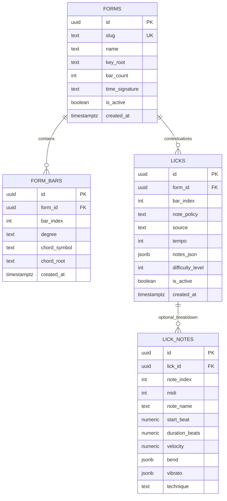

# Supabase Entities (Minimal v1)

This is the minimal semantic model for EchoLick persistence.

Scope goal: keep only what is required to represent chord-grid context and lick generation choices.

## ER Diagram

Quick read:

- `forms` + `form_bars` define the full progression grid.
- `licks` stores one generated/curated phrase for one bar in one form.
- `lick_notes` is optional in v1 and can be added later if per-note SQL analytics is needed.

## Shared vocabulary

- **Form**: the full bar grid (ordered bars + chords).
- **Bar**: one position in a form (`bar_index`) with a concrete chord context.
- **Note policy**: melodic rule set used to pick notes (single concept).
- **Lick**: generated/curated phrase tied to one specific bar in one specific form.

## Core entities

### 1) `forms`

- `id uuid primary key default gen_random_uuid()`
- `slug text unique not null` (example: `blues_12_major_basic_a`)
- `name text not null`
- `key_root text not null` (example: `A`, `E`, `B`, `C`)
- `bar_count int not null check (bar_count > 0)`
- `time_signature text not null default '4/4'`
- `description text null`
- `is_active boolean not null default true`
- `created_at timestamptz not null default now()`

### 2) `form_bars`

- `id uuid primary key default gen_random_uuid()`
- `form_id uuid not null references forms(id) on delete cascade`
- `bar_index int not null` (0-based)
- `degree text not null` (minimal for now: `I`, `IV`, `V`)
- `chord_symbol text not null` (example: `A7`, `D7`, `E7`)
- `chord_root text null`
- `created_at timestamptz not null default now()`

Constraints and indexes:

- `unique (form_id, bar_index)`
- index on `(form_id, bar_index)`

### 3) `licks`

- `id uuid primary key default gen_random_uuid()`
- `form_id uuid not null references forms(id) on delete cascade`
- `bar_index int not null`
- `note_policy text not null`
  - examples:
    - `minor_penta_root`
    - `major_penta_root`
    - `mix_major_minor`
    - `chord_tones_plus_passing`
- `source text not null default 'ai'`
  - examples: `ai`, `curated`, `imported`
- `tempo int not null check (tempo between 40 and 220)`
- `notes_json jsonb not null`
- `difficulty_level int null` (optional cached derived value)
- `is_active boolean not null default true`
- `created_at timestamptz not null default now()`

Constraints and indexes:

- `check (bar_index >= 0)`
- index on `(form_id, bar_index)`
- index on `(note_policy, created_at desc)`
- index on `(is_active, created_at desc)`

Note: `bar_index` versus `forms.bar_count` is validated at application layer in v1.

### 4) `lick_notes` (optional in v1)

Add only when you need note-level SQL queries early.

- `id uuid primary key default gen_random_uuid()`
- `lick_id uuid not null references licks(id) on delete cascade`
- `note_index int not null`
- `midi int not null`
- `note_name text not null`
- `start_beat numeric not null`
- `duration_beats numeric not null`
- `velocity numeric not null`
- `bend jsonb null`
- `vibrato jsonb null`
- `technique text not null default 'normal'`

Constraints:

- `unique (lick_id, note_index)`

## Derived concepts (not first-class tables in v1)

- **Difficulty**: derived from note count, range/leaps, rhythmic density, articulation.
- **Game stage** (`starter`, `bends`, `mixed`): remains app logic for now.

## Suggested migration order

1. Create `forms`, `form_bars`, `licks`.
2. Seed initial forms in keys `E`, `A`, `B`, `C`.
3. Save generated licks in `licks.notes_json`.
4. Add `lick_notes` later when per-note SQL analytics is needed.
